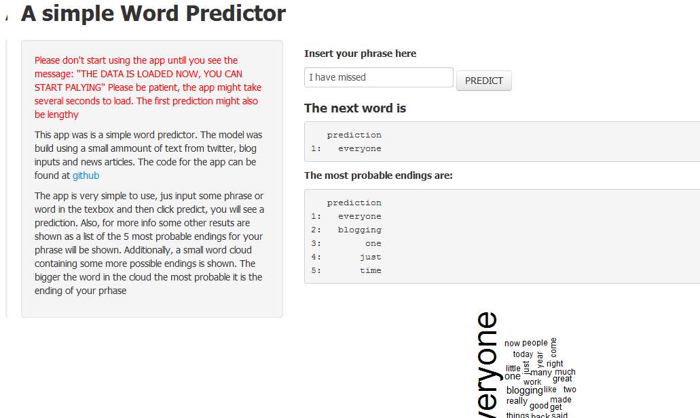

# A Basic Phrase Completion App. 
<h3>Project for Data mining Specialization</h3> 
<h5>By: A. Zambrano (azambranog)</h5>

---

##  Motivation

1. We use word predictors very often in our everyday online activities.
2. Web search engines, shopping websites, social media, phone texting aapps. All of these have often word prediction algorithms embeded.
3. In the particular case of smartphones, the algorithmns run in a more limited capacity than on webservers. This requires good and compact models.
4. Use publicaly available data (from twitter, blog entries and news) to model simple word predictors.

--- 

## Model
- The model is based on a small selection of twitter, blogs and news text.
- We found frequency of words, 2-grams, 3-grams and 4-grams, and transform them to probabilities
- For each 4-gram we calculate a robability value (p2) based in all the other n-grams probablities (p). For example, for the 4-gram "A B C D":
```{r, eval=FALSE}
p2("A B C D") = 60*p("A B C D") + 25*p("B C D") + 10*p("C D") + 5*p("D")
```

- this p2 value was stored in a very large table. Because the shiniapps.io website has limited ammount of memory, we had to shorten the table significantly. We remove terms with smallest p2 values. This caused a sifnificant lost in precission

--- 

## How does the app use the model?

1. The app reads the input and cleans symbols, filters profanities, removes extra spaces, lowercase, etc.
2. Search on the table for possible endings, beacuse the input might not appear in the 4-gram table exactly, we create a method that tries to find the best possibility even if the exact phrase is not found. For example, if your phrase is "I go to the...", for each ending "YY" we calculate:
```{r, eval=FALSE}
p("YY") = w1*p("go to the YY") + w2*sum(p("X to the YY")) + w3*sum(p("X X the YY")) + w4*sum(p("go to X YY")) + w5*sum(p("X to X YY")) + w5*sum(p("X X the YY")) + w5*sum(p("go X the YY")).....
```
where  X is any word and wn are wheights calculated experimentally

--- 

## App instructions



- Wait for the app to load, it will take several seconds, you will know when the app is loaded because you will see the message: THE DATA IS LOADED NOW, YOU CAN START PALYING.. your first prediction might take some secons too.

- Just type a phrase and then click on predict, you will get an ending, a list of other 5 possible words and a nice wordcloud with more possible words.
The app can be found in [my shiny apps webpage](http://azambranog.shinyapps.io/wordApp/)